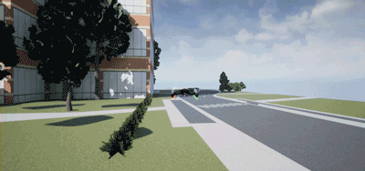
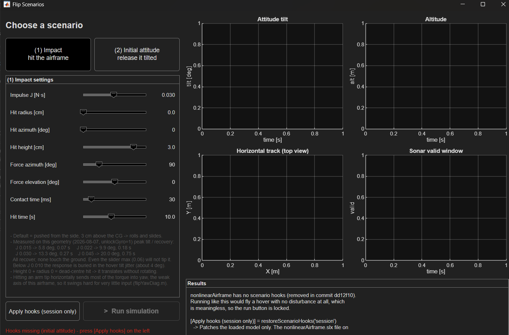

<h1 align="center">Flip-Project</h1>

<p align="center">
  <b>Attitude recovery of a quadcopter hit by a sharp torque disturbance.</b>
</p>



Past 90° of tilt the available torque can no longer pull the vehicle back, so instead of fighting
the tumble the controller **carries it through a full 360° flip on its own momentum** and then
re-stabilizes. A closed-form momentum criterion decides which of the two to do, and the whole loop
runs on estimated state only — no ground truth, no motion capture.

[Quick Start](#quick-start) ·
[Usage](#usage) ·
[How It Works](#how-it-works) ·
[Layout](#repository-layout) ·
[Limitations](#known-limitations--roadmap) ·
[References](#references)

---

## Quick Start

**Requirements** — MATLAB + Simulink (developed on R2025b), Aerospace Blockset, Simulink Support
Package for Parrot Minidrones, Stateflow.

```matlab
cd asbQuadcopter
open('Quadcopter.prj')                % opens the project and sets the path
run('utilities/startVars.m')          % loads vehicle / sensor / controller / estimator params
flipScenarioUI                        % pick a disturbance, drag a slider, hit run
```

`startVars.m` is the single entry point; it calls `tasks/vehicleVars.m`, `sensorsVars.m`,
`controllerVars.m` and `estimatorVars.m` in order. Never set a parameter by hand without
re-running the corresponding `*Vars.m` — the model reads the struct, not your variable.

To fly one plain simulation without the UI, replace the last line with `sim('asbQuadcopter')`.

---

## Usage

### 1. Scenario UI — start here

A single window that lets you throw a disturbance at the vehicle, fly it, and read the outcome —
no block diagram editing, no `set_param`. This is the intended entry point for anyone who wants
to *use* the controller rather than modify it.



**Two scenarios, one screen:**

| | What it does | Physically |
|---|---|---|
| **(1) Impact** | Hits the airframe at a point you choose, with an impulse and direction you choose | Applies a body-frame force **F** *and* the matching torque **r × F** — the drone is both shoved and spun |
| **(2) Initial attitude** | Releases the drone at altitude, already tilted, optionally already spinning | Sets the plant's initial `Cbe`, `ω`, and position directly, then lets it recover and fly home |

#### (1) Impact controls

| Slider | Range | Default |
|---|---|---|
| Impulse `J` [N·s] | 0.002 – 0.06 | 0.030 |
| Hit radius [cm] | 0 – 6.24 (arm length) | 0 |
| Hit azimuth [deg] | 0 – 360 | 0 |
| Hit height above CG [cm] | −5 – 5 | 3 |
| Force azimuth [deg] | 0 – 360 | 90 |
| Force elevation [deg] | −90 – 90 | 0 |
| Contact time [ms] | 20 – 100 | 30 |
| Hit time [s] | 6 – 15 | 10 |

The default is *"shoved sideways 3 cm above the CG"* — it rolls and slides. Nothing within the
slider range tips the vehicle over; even the maximum impulse of 0.06 N·s recovers without ground
contact, and below J ≈ 0.010 the response disappears into the ~4° tilt jitter of the hover itself.

Two geometry notes worth knowing before you sweep: height 0 + radius 0 is a dead-centre hit, so
it translates without rotating at all; and hitting the **tip of an arm horizontally** dumps almost
all the torque into yaw, which is this airframe's weak axis and swings hard for very little input
(see `flipYawDiag.m`).

#### (2) Initial-attitude controls

| Slider | Range | Default |
|---|---|---|
| Initial tilt [deg] | 0 – 180 | 120 |
| Tilt azimuth [deg] | 0 – 360 | 0 |
| Release altitude [m] | 2 – 25 | 10 |
| Initial spin [deg/s] | 0 – 600 | 0 |
| Motor hold [s] | 0 – 1.5 | 0 |

During the motor-hold window only idle thrust is commanded, so the vehicle is effectively in free
fall; at 0 the controller fights from `t = 0`. A live hint under the sliders warns you when the
release altitude leaves the survivable band.

The variable that decides the outcome is **release altitude, not tilt**. Attitude recovery itself
is fast; what kills the run is the altitude lost while recovering, and anything released above the
3 m hover target never gets it back.

#### The airframe hooks

Both scenarios drive three hooks inside `nonlinearAirframe` (impact force generator, motor gate,
and the `init_*` plant initial conditions). Those hooks were removed in commit `dd12f10`, so on a
fresh checkout the UI will find them missing and **lock the run button** rather than quietly fly a
plain hover and score it as a success.

| Button / call | Effect |
|---|---|
| `[Apply hooks (session only)]` → `restoreScenarioHooks('session')` | Patches the **loaded model only**. No diff on the shared `.slx`, no merge conflict. Gone when MATLAB closes — press it again each session. |
| `restoreScenarioHooks('apply')` | Writes the hooks back to `nonlinearAirframe.slx` **on disk**. This modifies the shared binary model. |
| `restoreScenarioHooks('check')` | Returns a status struct without changing anything. |

#### Reading the output

Four live plots — tilt, altitude, horizontal track, and the window where the sonar is actually
trusted — plus a metric panel: peak tilt, recovery time (first return below 5°), minimum altitude,
maximum horizontal excursion, final position/altitude/tilt error, and sonar duty cycle.

A run is scored **SUCCESS** only if all four hold:

```
no ground contact  &&  final tilt < 10°  &&  horizontal error < 1.0 m  &&  |altitude error| < 0.5 m
```

> [!NOTE]
> Metrics stop at the **first ground contact**. The plant models the ground by pinning `z` and
> killing downward velocity only — horizontal speed survives, so a crashed airframe slides for
> hundreds of metres. Scoring that tail once produced a "maxDev 2180 m".

The status bar always states which gyro regime you are in. If it reads
`gyro saturation OFF (unlockGyro=1)`, the numbers on screen are **no-saturation** numbers.

The UI restores everything it touches — workspace variables, `StopTime`, `StopFcn`, logging flags,
pacing, and the estimator's dirty flag — so it leaves no trace on the shared models.

### 2. Analysis helpers

| Call | Use it for |
|---|---|
| `monitorFlip` | Run once and plot tilt + body rate. The quickest "did it flip?" check |
| `flipGraph` | Rotation angle / tilt / rate. Fires automatically as the model's `StopFcn` |
| `compareEstimator` | True attitude vs. estimated attitude, tilt and yaw |
| `flipYawDiag(Avec)` | Diagonal-disturbance yaw diagnosis — is yaw the cause of divergence, or a symptom? |

All plots use a dark background with light traces.

### 3. Ideal-gyro switch

To isolate what saturation alone is costing you:

```matlab
unlockGyro = 1; sensorsVars;    % ideal — full scale × 1e5
unlockGyro = 0; sensorsVars;    % real  — back to 34.907 rad/s
```

Changing the variable alone does nothing; `sensorsVars` **must** be re-run. Verify with
`Sensors.IMU.gyroLimits(4)`. Any number obtained under `unlockGyro = 1` is a no-saturation number
and should be labelled as such wherever it is reported.

---

## How It Works

### The problem

The vehicle is a Parrot Mambo running the MathWorks quadcopter reference model, with the stock
attitude controller replaced by a geometric PD on SO(3) and the stock estimator extended. Vehicle,
sensor, controller and estimator parameters all live in `asbQuadcopter/tasks/*.m` and are loaded by
`utilities/startVars.m`.

Torque authority is finite, so angular acceleration is capped:

$$a_{\max} = \frac{\tau_{\max}}{J} \approx 394\ \mathrm{rad/s^2}$$

Once tilt exceeds 90°, gravity-aligned recovery has to reverse the body rate *and* climb back
against the remaining tilt. Below a certain rate that is impossible within $a_{\max}$ — the
controller commands full torque, does not win, and the vehicle ends up in a slow uncontrolled
tumble. Finishing the rotation is cheaper than reversing it.

### The criterion

Integrating $\dot\omega = -a_{\max}$ from tilt $\theta$ to the inverted point $\pi$ gives the
minimum rate that still completes the rotation:

$$\omega_{\mathrm{crit}}(\theta) = \sqrt{2\,a_{\max}\,(\pi - \theta)}$$

At $\theta = 90°$ this evaluates to **35.18 rad/s**. The flip mode is entered and left by a
two-condition state machine:

| | Condition |
|---|---|
| **Enter flip** | `R33 < 0`  ∥  `w_tilt > ω_crit(θ)` |
| **Exit flip** | `R33 > 0.707` (45°)  &&  `w_tilt < τ_max/kW ≈ 4.7` |

Predicted vs. observed flip-through was **6/6** on the single-axis sweep.

> [!IMPORTANT]
> $\omega_{\mathrm{crit}}$ is a **planar (single-axis)** result. It does not carry over to
> diagonal disturbances or fully 3-D tumbles, where the gyroscopic term $\omega \times J\omega$
> is no longer zero. Extending the criterion to 3-D is an open item.

### A physical collision

Note that the flip threshold, 35.18 rad/s, sits **above** the gyro full scale of 34.907 rad/s
(2000 dps). Any flip that actually completes therefore saturates the rate gyro by construction —
the saturation is not a tuning problem, it is unavoidable on this hardware. The angle lost while
the measurement is clipped is approximately

$$\Delta\theta_{\mathrm{lost}} \approx \frac{(\omega_0 - \mathrm{FS})^2}{2\,a_{\max}}$$

Measured peak rate during a flip is 67.59 rad/s against FS 34.907, i.e. 0.070 s of clipping.
Predicted loss 77.7° vs. measured tilt error **72.62°** — the model holds.

### The controller

Fixed level-attitude target, geometric PD on SO(3) — this is a **stabilizer, not a trajectory
tracker**:

$$\tau = -k_R\,e_R - k_\Omega\,e_\Omega + \omega \times J\omega$$

with $k_R = 0.06$ ($\omega_n \approx 29$) and $k_\Omega = 0.006$ ($\zeta \approx 1.45$), roughly
2.2× faster than the stock PID. Attitude error is taken directly on the rotation matrix — the
control path never passes through Euler angles, which gimbal-lock at pitch ±90° and destroyed an
earlier yaw estimate.

Yaw is decoupled from roll/pitch by a tilt-torsion split, so a diagonal disturbance does not
force the weak yaw axis to fight the strong ones.

## Repository Layout

```
asbQuadcopter/
├── mainModels/asbQuadcopter.slx   top-level closed loop
├── controller/                    geometric PD, flip state machine, state estimator
├── nonlinearAirframe/             plant — SO(3) dynamics, RK4 + Magnus commutator update
├── tasks/                         parameter definitions (vehicle/sensors/controller/estimator)
├── utilities/startVars.m          entry point — run this first
├── flipScenarioUI.m               disturbance UI — the front door
├── restoreScenarioHooks.m         puts the airframe hooks the UI needs back
├── flipSweep.m                    disturbance sweep driver
├── flipGraph.m, monitorFlip.m     analysis and live plots
├── compareEstimator.m             true vs. estimated attitude
├── flipYawDiag.m                  diagonal-disturbance yaw diagnosis
└── flipResults/                   sweep outputs (csv / mat / png)

Flip3DOF/                          planar 3-DOF sandbox used to size the gains
├── flipDynamics.m                 SO(3) plant
├── flipController.m               geometric controller
└── motorSat.m                     motor saturation model
```

`Flip3DOF/` is the reduced planar model the criterion and the initial gains were derived on. It
has no estimator and no roll/yaw coupling — it exists to make the physics checkable by hand
before touching the full Simulink loop.

## Known Limitations & Roadmap

- [x] Remove all ground-truth injection ("cheats") from the control path
- [x] Establish the real-gyro baseline and quantify the saturation share (70 %)
- [x] Backward reconstruction across the saturated window (`A` 0.13 → 0.28)
- [ ] Close the remaining estimator gap above `A = 0.30`
- [ ] The `A ≈ 0.14–0.20` hole — fails even with an ideal gyro
- [ ] Break the altitude feedback loop: saturation → tilt error → sonar tilt-compensation →
      altitude → thrust → tilt error again. Recovery time constant degrades 3.17 s → 64.58 s
      when altitude comes from the estimator rather than truth
- [ ] Gate optical flow during flips — it reads 141 against a true 0.01 while inverted
- [ ] Re-run the diagonal sweep with cheats removed (only the single axis has been re-measured)
- [ ] Extend $\omega_{\mathrm{crit}}$ to 3-D, where $|\omega \times J\omega| = 0.041$ N·m already
      exceeds $\tau_{\max} = 0.023$ N·m at $\omega_0 = [40\ 30\ 20]$

Rejected after analysis, kept here so they don't get re-proposed:

| Idea | Why not |
|---|---|
| Barometer / optical flow to cover saturation | The saturated window is 0.070 s ≈ 14 Hz; both sensors are band-limited to a few Hz |
| Differentiate sonar to get tilt | $\dot h$ and $\dot\theta$ are not separable, and the target leaves the beam cone |
| Switch to an EKF for saturation | Saturation is a *bias*, not extra noise — no covariance tuning recovers it. Still useful for the recovery time constant |

A Tobit Kalman filter, which treats a saturated sample as a *censored* measurement rather than a
wrong one, is the principled long-term fix and remains on the list.

## References

1. T. Lee, M. Leok, N. H. McClamroch, *Geometric Tracking Control of a Quadrotor UAV on SE(3)*, IEEE CDC, 2010.
2. S. Lupashin, A. Schöllig, M. Sherback, R. D'Andrea, [*A Simple Learning Strategy for High-Speed Quadrocopter Multi-Flips*](https://ethz.ch/content/dam/ethz/special-interest/mavt/dynamic-systems-n-control/idsc-dam/Research_DAndrea/FMA/LupashinSchoellig_ICRA2010.pdf), IEEE ICRA, 2010.
3. R. Mahony, T. Hamel, J.-M. Pflimlin, *Nonlinear Complementary Filters on the Special Orthogonal Group*, IEEE TAC, 53(5), 2008.
4. B. Allik, C. Miller, M. J. Piovoso, R. Zurakowski, [*The Tobit Kalman Filter: An Estimator for Censored Measurements*](https://ieeexplore.ieee.org/document/7114258/), IEEE TCST, 24(1), 2016.
5. MathWorks, *Quadcopter Project* (Aerospace Blockset) — the reference model this work builds on.

## License

TBD.
